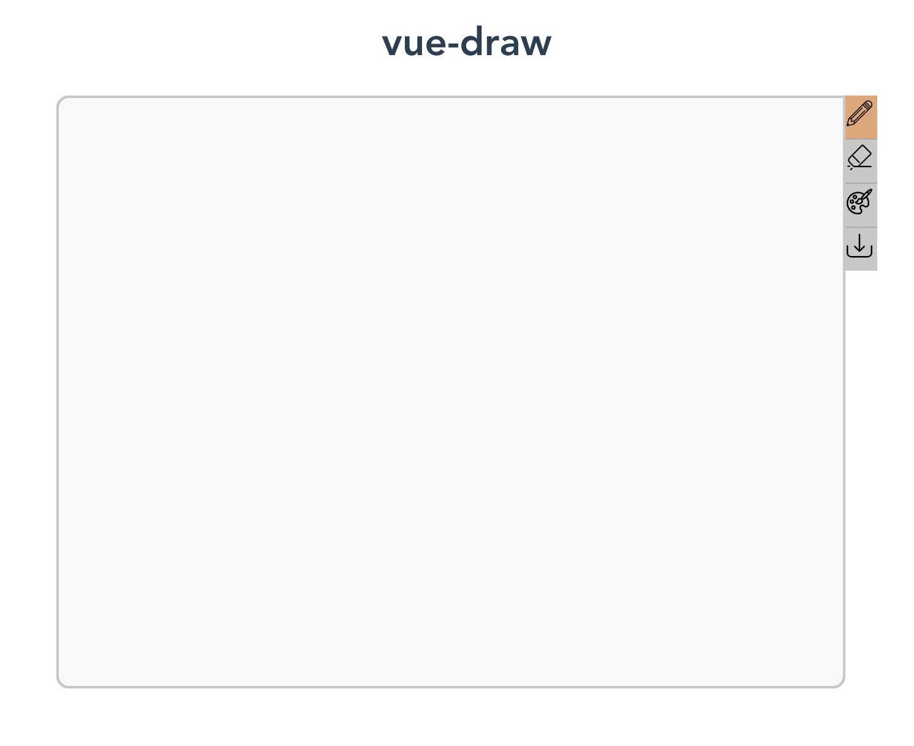

# vue-draw



## Props
``` html
   <CanvasDraw
    :width="640"
    :height="480"
    :brushSize="18"
    :outputName="'example'"/>
```

| Prop        | Type    | Default |
| ----------- |:-------:| -------:|
| width       | Number  | 640     |
| height      | Number  | 480     |
| brushSize   | Number  | 12      |
| outputName  | String  | canvas  |

## TODOs

- [ ] More Tools (Paint Bucket etc.)
- [ ] Canvas Export Settings
- [ ] Better UI!
